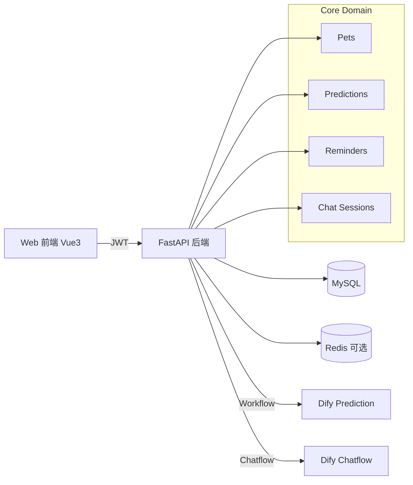

# 宠物信息管理系统 AI 开发实施文档

## 1. 文档目标
本文件用于指导代码生成型 AI 完成一个可运行、可部署、可验收的宠物信息管理系统。

系统核心目标：
- 提供宠物档案管理
- 对接 Dify 工作流做患病风险预测
- 提供智能体咨询能力
- 提供提醒管理能力
- 提供用户账号体系

本项目默认交付 Web 版（前后端分离），首版不做小程序。

---

## 2. 项目范围

### 2.1 功能范围（必须实现）
1. 首页
- 展示宠物科普知识（图文列表）
- 支持分类筛选与详情查看

2. 个人中心
- 注册、登录、退出登录
- 查看与编辑个人资料
- 修改密码

3. 宠物信息管理与预测
- 新增/编辑/删除宠物档案
- 维护字段：物种、年龄、体重、患病史、疫苗史等
- 宠物信息变更后可触发 Dify 患病预测工作流
- 展示预测结果（风险等级、摘要、建议）
- 预测完成后询问是否创建提醒

4. 咨询助手
- 提供多轮对话界面
- 对接智能体接口
- 保存会话历史

5. 提醒
- 创建提醒（如体检、疫苗、喂药、复诊）
- 编辑、删除、开启/关闭提醒
- 到期状态展示（今日/即将到期/已过期）

### 2.2 非范围（V1 不做）
- 支付功能
- 多租户企业后台
- 复杂推荐算法
- 医疗诊断结论（仅做风险提示，不替代医生）

---

## 3. 推荐技术栈（固定）

### 3.1 前端
- Vue 3 + TypeScript + Vite
- Vue Router
- Pinia
- Element Plus
- Axios

### 3.2 后端
- Python 3.11
- FastAPI
- SQLAlchemy + Alembic
- Pydantic
- JWT 鉴权

### 3.3 数据库与基础设施
- MySQL 8（开发环境可用 SQLite）
- Redis（可选，用于缓存与会话）
- Docker Compose（可选部署方式）

### 3.4 外部集成
- Dify Workflow API（患病预测）
- Dify Chat/Agent API（咨询助手）

---

## 4. 系统角色与权限

### 4.1 角色
- 普通用户（唯一角色，V1）

### 4.2 权限原则
- 用户只能访问自己的宠物、预测、提醒、会话数据
- 需要登录后才可访问个人中心、宠物管理、预测、提醒、咨询历史

---

## 5. 信息架构与页面清单

### 5.1 路由建议
- /（首页）
- /auth/login（登录）
- /auth/register（注册）
- /profile（个人中心）
- /pets（宠物列表）
- /pets/:id（宠物详情）
- /pets/:id/edit（编辑宠物）
- /pets/:id/predictions（预测结果）
- /assistant（咨询助手）
- /reminders（提醒列表）

### 5.2 页面关键交互
1. 宠物更新后触发预测
- 用户保存宠物信息
- 前端弹窗：是否立即更新患病风险预测
- 选择“是”则调用预测接口
- 返回结果后弹窗：是否基于结果创建提醒

2. 咨询助手
- 左侧会话列表，右侧消息流
- 发送消息后展示“思考中”状态
- 支持重新生成最后一次回复

3. 提醒
- 支持按宠物筛选
- 支持按状态筛选（全部/今日/即将到期/已过期）

---

## 6. 数据模型（数据库表）

### 6.1 users
- id: bigint, pk
- username: varchar(50), unique
- email: varchar(100), unique
- password_hash: varchar(255)
- nickname: varchar(50)
- created_at: datetime
- updated_at: datetime

### 6.2 pets
- id: bigint, pk
- user_id: bigint, fk -> users.id
- name: varchar(50)
- species: varchar(30)  // dog/cat/other
- breed: varchar(50)
- gender: varchar(10)   // male/female/unknown
- birth_date: date, nullable
- weight_kg: decimal(5,2)
- disease_history: text
- vaccine_history: text
- note: text
- is_deleted: tinyint, default 0
- created_at: datetime
- updated_at: datetime

### 6.3 predictions
- id: bigint, pk
- user_id: bigint, fk
- pet_id: bigint, fk
- input_snapshot: json
- risk_level: varchar(20)   // low/medium/high
- summary: text
- suggestion: text
- raw_response: json
- provider: varchar(30)     // dify
- created_at: datetime

### 6.4 reminders
- id: bigint, pk
- user_id: bigint, fk
- pet_id: bigint, fk, nullable
- title: varchar(100)
- reminder_type: varchar(30) // vaccine/checkup/medicine/revisit/other
- remind_at: datetime
- repeat_rule: varchar(30)   // none/daily/weekly/monthly
- status: varchar(20)        // active/inactive/done
- source_prediction_id: bigint, fk, nullable
- created_at: datetime
- updated_at: datetime

### 6.5 chat_sessions
- id: bigint, pk
- user_id: bigint, fk
- title: varchar(100)
- created_at: datetime
- updated_at: datetime

### 6.6 chat_messages
- id: bigint, pk
- session_id: bigint, fk -> chat_sessions.id
- role: varchar(20) // user/assistant/system
- content: text
- raw_response: json, nullable
- created_at: datetime

### 6.7 knowledge_articles
- id: bigint, pk
- title: varchar(200)
- category: varchar(50)
- cover_url: varchar(255)
- content_md: longtext
- is_published: tinyint
- created_at: datetime
- updated_at: datetime

---

## 7. API 设计（后端 REST）

### 7.1 认证
- POST /api/v1/auth/register
- POST /api/v1/auth/login
- POST /api/v1/auth/logout
- POST /api/v1/auth/change-password
- GET /api/v1/auth/me

### 7.2 宠物
- GET /api/v1/pets
- POST /api/v1/pets
- GET /api/v1/pets/{pet_id}
- PUT /api/v1/pets/{pet_id}
- DELETE /api/v1/pets/{pet_id}

### 7.3 预测
- POST /api/v1/pets/{pet_id}/predict
- GET /api/v1/pets/{pet_id}/predictions
- GET /api/v1/predictions/{prediction_id}

### 7.4 提醒
- GET /api/v1/reminders
- POST /api/v1/reminders
- PUT /api/v1/reminders/{reminder_id}
- DELETE /api/v1/reminders/{reminder_id}
- POST /api/v1/reminders/{reminder_id}/toggle

### 7.5 咨询助手
- GET /api/v1/chat/sessions
- POST /api/v1/chat/sessions
- GET /api/v1/chat/sessions/{session_id}/messages
- POST /api/v1/chat/sessions/{session_id}/messages

### 7.6 首页内容
- GET /api/v1/articles
- GET /api/v1/articles/{article_id}

---

## 8. Dify 集成规范

### 8.1 环境变量
- DIFY_BASE_URL=http://47.113.151.36/v1
- DIFY_API_KEY=
- DIFY_PREDICTION_WORKFLOW_ID=
- DIFY_CHATFLOW_APP_ID=
- DIFY_REQUEST_TIMEOUT_SECONDS=15
- DIFY_ENABLE_MOCK=true  // 未配置真实 Dify 时默认启用 mock，保证项目可运行可演示

### 8.2 患病预测调用（固定为 Workflow）
调用方式：
- 使用 Dify Workflow API
- 由后端 `integrations/prediction_client` 统一封装调用
- 前端不得直接调用 Dify

触发时机：
- 新增宠物后可选触发
- 修改宠物关键字段后提示触发

输入字段（结构化传入 workflow）：
- pet_name: string
- species: string
- breed: string
- gender: string
- birth_date: string|null，格式 YYYY-MM-DD
- weight_kg: number
- disease_history: string
- vaccine_history: string
- note: string

要求 Workflow 最终必须返回如下结构化 JSON（后端按此解析入库）：

```json
{
  "risk_level": "low",
  "summary": "当前整体风险较低，但建议持续观察食欲和精神状态。",
  "suggestion": "建议 1-2 周内复查基础体征，如有持续异常及时就医。",
  "risk_factors": [
    "近期食欲波动",
    "疫苗记录不完整"
  ],
  "recommended_reminders": [
    {
      "title": "安排基础体检",
      "reminder_type": "checkup",
      "days_from_now": 7
    }
  ]
}
```

字段约束：
- risk_level: 仅允许 `low | medium | high`
- summary: string，1~500 字
- suggestion: string，1~500 字
- risk_factors: string[]，可为空数组
- recommended_reminders: array，可为空数组
- recommended_reminders[].title: string
- recommended_reminders[].reminder_type: 仅允许 `vaccine | checkup | medicine | revisit | other`
- recommended_reminders[].days_from_now: int，>= 0

本地 predictions 表至少持久化：
- risk_level
- summary
- suggestion
- raw_response
- provider=dify

若 Workflow 无法直接输出以上 JSON，则应在 Dify 侧增加结构化输出节点或在最终回答中严格输出 JSON 对象，避免后端做自然语言解析。

失败处理：
- 调用失败时保存失败日志
- 前端提示“预测失败，请稍后重试”
- 不影响宠物资料保存
- 若 `DIFY_ENABLE_MOCK=true` 或 Dify 配置缺失，则返回固定 mock 结构，保证演示可用

### 8.3 咨询助手调用（固定为 Chatflow）
调用方式：
- 使用 Dify Chatflow API
- 首版采用非流式返回，统一为同步请求-响应模式
- 由后端 `integrations/chat_client` 统一封装调用

请求建议字段：
- query: 用户消息文本
- conversation_id: Dify 会话 ID，可为空
- user: 本地 user_id 字符串
- inputs: 可附带当前宠物上下文（可选）

要求 Chatflow 返回后，后端至少提取并保存以下字段：
- answer: 助手回复正文
- conversation_id: Dify 会话标识
- message_id: Dify 消息标识
- raw_response: 完整原始响应

本地 chat_messages 表持久化规则：
- 用户发送时先写入一条 role=user
- Chatflow 成功后写入一条 role=assistant
- assistant 消息 content 使用 answer 字段
- raw_response 保存完整 Dify 响应

失败处理：
- 超时与失败时友好提示
- 不删除已写入的用户消息
- 若 `DIFY_ENABLE_MOCK=true` 或 Dify 配置缺失，则返回固定 mock 回复，保证咨询页可演示

### 8.4 Dify 对接实现约束
- 所有 Dify 调用必须通过后端 service/integration 层，不允许散落在路由控制器
- 真实 Dify 与 mock provider 必须实现统一接口，允许通过配置切换
- 后端需记录第三方请求耗时、request_id、trace_id
- 前端只感知本系统 API，不感知 Dify URL 与鉴权细节

---

## 9. 前端实现要求

### 9.1 通用
- 所有表单需要前端校验与后端校验
- 所有接口统一错误处理
- JWT 过期自动跳转登录
- 关键操作（删除）二次确认
- UI 风格固定为：Element Plus + 简洁卡片式产品风格，配色温和，适合宠物主题
- 首页科普内容来自后端 `knowledge_articles` 表，不提供搜索，仅提供分类筛选与详情查看

### 9.2 宠物表单校验
- 名称必填
- 物种必填，枚举：`dog | cat | other`
- 性别枚举：`male | female | unknown`
- 出生日期可为空；若填写必须小于等于当前日期
- 体重 > 0

### 9.3 体验细节
- 列表页提供加载态、空状态、错误态
- 预测结果支持卡片化展示
- 聊天消息支持回车发送，Shift+Enter 换行
- 咨询消息支持 Markdown 基础渲染
- 支持删除会话、重命名会话、重新生成最后一次回复
- 首页文章列表采用卡片流布局；宠物、提醒采用表格 + 抽屉/弹窗编辑的后台产品化布局

---

## 10. 后端实现要求

### 10.1 安全
- 密码哈希（bcrypt）
- JWT 鉴权中间件
- 采用最简认证方案：仅使用 access token，不实现 refresh token
- 登录方式固定为：username + password
- 前端将 token 存储于 localStorage
- 注册字段固定为：username、email、password、nickname
- 接口按 user_id 做数据隔离
- 基础限流（登录接口）

### 10.2 数据一致性
- 删除宠物采用软删除：`pets.is_deleted=1`
- 已软删除宠物默认不出现在列表、详情、下拉选项中
- reminders 与 predictions 历史数据保留，不做物理删除
- 已删除宠物不可再新增新的提醒或预测
- reminders.status 仅存储 `active | inactive | done`
- “今日 / 即将到期 / 已过期”属于查询时动态计算标签，不单独持久化
- 外部调用（Dify）失败时不回滚本地已成功事务

### 10.3 日志与可观测
- 记录请求日志、错误日志、第三方调用耗时
- 为 Dify 调用记录 trace_id（便于排查）
- 生产环境禁止返回堆栈给前端
- 日志中脱敏 email、token、健康史等敏感信息

---

## 11. 验收标准（必须全部通过）

1. 账号体系
- 可注册、登录、退出、修改密码

2. 宠物档案
- 可新增、编辑、删除、查看列表和详情

3. 预测联动
- 修改宠物后可触发预测
- 可展示预测结果并持久化
- 可从预测结果创建提醒

4. 咨询助手
- 可进行连续多轮对话
- 会话可持久化并回看历史

5. 提醒
- 可增删改查
- 状态显示正确

6. 权限与安全
- A 用户不可访问 B 用户数据

7. 工程质量
- 后端 API 文档可访问（OpenAPI）
- 前端具备基础异常处理与空态处理

---

## 12. 测试要求

### 12.1 后端
- 单元测试：认证、宠物 CRUD、提醒 CRUD、预测接口
- 集成测试：Dify 调用统一 mock
- 测试环境默认使用 SQLite

### 12.2 前端
- 关键页面的组件测试（登录、宠物表单、预测结果、提醒列表）
- E2E（推荐实现）：登录 -> 新增宠物 -> 触发预测 -> 创建提醒

---

## 13. 项目结构建议

```text
project-root/
  frontend/
    src/
      api/
      views/
      components/
      stores/
      router/
      utils/
  backend/
    app/
      api/
      core/
      models/
      schemas/
      services/
      repositories/
      integrations/
    alembic/
  docs/
  docker-compose.yml
  README.md
```

---

## 14. 交付清单
- 可运行源码（前后端）
- 初始化 SQL 或迁移脚本
- 环境变量示例文件（.env.example）
- Docker Compose 一键启动文件
- 演示数据脚本（默认 1 个用户、2 只宠物、3 条提醒、3 篇科普文章）
- 部署说明
- 测试说明

---

## 15. 交给 AI 的执行指令模板（可直接复制）
请严格按以下要求生成完整项目代码：

1) 使用本文档定义的技术栈，不要替换框架。
2) 按“项目结构建议”创建完整目录。
3) 先实现后端 API 与数据库迁移，再实现前端页面与接口联调。
4) Dify 对接必须通过独立 integration/service 封装，不允许散落在控制器。
5) 每个模块完成后给出可运行步骤与自测结果。
6) 提供默认演示数据（1 个用户、2 只宠物、3 条提醒、3 篇科普文章）。
7) 输出 README，包含：启动方式、环境变量、接口说明、测试命令。
8) 若某参数无法确定，先使用占位配置并在 README 标注。
9) 必须提供 Docker Compose 一键启动方案；执行 `docker compose up --build` 后可直接访问前后端。
10) 首次启动需自动完成数据库迁移并导入演示数据。
11) 若 Dify 未配置或不可用，系统必须自动切换到 mock provider，保证预测与咨询页面仍可演示。
12) 认证方案固定为：username + password 登录，仅 access token，无 refresh token。
13) 宠物年龄方案固定为：以 `birth_date` 为唯一年龄来源，前后端动态计算年龄展示，不单独持久化 `age_months`。
14) 删除宠物固定为软删除，不允许物理删除 pets 记录。

最终交付要求：
- 本地一键启动
- 前后端可联通
- 功能满足验收标准
- 无阻塞性报错
- 即使未接入真实 Dify，也能以 mock 数据完整演示主流程

---

## 16. 风险与约束
- 医疗相关内容仅作参考，不构成诊断建议。
- Dify 服务不可用时需优雅降级。
- 涉及隐私数据（宠物健康信息）必须最小化暴露。

---

## 17. 统一接口规范（强制）

### 17.1 统一响应结构
成功响应：

```json
{
  "code": 0,
  "message": "ok",
  "data": {},
  "request_id": "req_20260330_xxx",
  "timestamp": "2026-03-30T10:00:00Z"
}
```

失败响应：

```json
{
  "code": 40001,
  "message": "参数校验失败",
  "data": null,
  "request_id": "req_20260330_xxx",
  "timestamp": "2026-03-30T10:00:00Z"
}
```

### 17.2 错误码约定
- 0: 成功
- 40001: 参数校验失败
- 40002: 未登录或 Token 无效
- 40003: 无权限访问
- 40004: 资源不存在
- 40009: 请求过于频繁
- 50001: 服务内部错误
- 50010: Dify 服务调用失败

### 17.3 分页约定
- 请求参数：page（默认 1）、page_size（默认 10，最大 100）
- 返回结构：items、total、page、page_size

### 17.4 枚举与字典约定（强制）
- pets.species：`dog | cat | other`
- pets.gender：`male | female | unknown`
- reminders.reminder_type：`vaccine | checkup | medicine | revisit | other`
- reminders.repeat_rule：`none | daily | weekly | monthly`
- reminders.status：`active | inactive | done`
- predictions.risk_level：`low | medium | high`
- chat_messages.role：`user | assistant | system`
- 前后端、数据库、接口响应统一使用英文枚举值；前端界面如需中文展示，使用本地映射，不得混用中英文存储值

---

## 18. 核心接口样例（给 AI 直接对齐）

### 18.1 注册
POST /api/v1/auth/register

请求体：

```json
{
  "username": "demo_user",
  "email": "demo@example.com",
  "password": "abc12345",
  "nickname": "演示用户"
}
```

### 18.2 登录
POST /api/v1/auth/login

请求体：

```json
{
  "username": "demo_user",
  "password": "abc12345"
}
```

成功返回 data：

```json
{
  "access_token": "jwt-token",
  "token_type": "Bearer",
  "expires_in": 86400,
  "user": {
    "id": 1,
    "username": "demo_user",
    "email": "demo@example.com",
    "nickname": "演示用户"
  }
}
```

### 18.3 新增宠物
POST /api/v1/pets

请求体：

```json
{
  "name": "Lucky",
  "species": "cat",
  "breed": "British Shorthair",
  "gender": "female",
  "birth_date": "2024-09-01",
  "weight_kg": 4.2,
  "disease_history": "none",
  "vaccine_history": "rabies-2025",
  "note": "近期精神状态正常"
}
```

### 18.4 触发预测
POST /api/v1/pets/{pet_id}/predict

返回 data 建议字段：
- prediction_id
- risk_level
- summary
- suggestion
- risk_factors
- recommended_reminders
- created_at

### 18.5 发送咨询消息
POST /api/v1/chat/sessions/{session_id}/messages

请求体：

```json
{
  "content": "猫咪最近食欲下降，应该先观察什么？"
}
```

成功返回 data 建议字段：
- user_message_id
- assistant_message_id
- answer
- conversation_id
- created_at

---

## 19. 关键业务规则补充

### 19.1 预测触发规则
- 当 species、birth_date、weight_kg、disease_history、vaccine_history 任一字段变化时，前端必须弹窗询问是否重新预测。
- 24 小时内同一宠物重复预测超过 5 次时，提示频率过高并要求用户确认。

### 19.2 提醒到期计算
- 今日：自然日内到期。
- 即将到期：未来 3 天内到期。
- 已过期：当前时间大于 remind_at 且 status 不是 done。
- 已过期仅作为接口返回标签，不回写数据库 status。
- 若 repeat_rule != none，首版不自动生成下一条提醒，仅保留重复规则字段供后续扩展。

### 19.3 会话标题生成
- 新会话标题默认取首条用户消息前 16 个字符。
- 用户可手动重命名会话标题。
- 支持删除会话。

### 19.4 年龄字段规则
- `birth_date` 为唯一年龄来源。
- 前端展示年龄时按当前日期动态换算月龄/年龄。
- 数据库不单独持久化 `age_months`，避免冗余与不一致。

---

## 20. 非功能性指标（NFR）

### 20.1 性能
- 普通查询接口 P95 < 300ms（不含 Dify 调用）。
- Dify 接口超时阈值：15s。
- 首页首屏资源建议 < 1.5MB。

### 20.2 可用性
- 关键接口（登录、宠物 CRUD、提醒 CRUD）可用率目标 >= 99.5%。
- Dify 不可用时，主流程可继续（仅预测/咨询能力降级）。

### 20.3 安全
- 密码最小长度 8，必须包含字母和数字。
- 生产环境禁止返回堆栈到前端。
- 日志中脱敏 email、token、健康史等敏感信息。

---

## 21. 开发里程碑与工期建议

### M1: 基础框架与认证（1-2 天）
- 完成前后端脚手架
- 完成注册/登录/鉴权
- 完成基础 CI（lint + test）

### M2: 宠物与提醒模块（2-3 天）
- 宠物 CRUD + 表单校验
- 提醒 CRUD + 状态筛选
- 基础联调

### M3: Dify 预测与咨询（2-3 天）
- 预测工作流接入
- 咨询助手接入 + 会话持久化
- 异常与降级策略

### M4: 测试、优化与交付（1-2 天）
- 补齐测试
- 性能与日志优化
- 完成 README 与部署文档

---

## 22. CI/CD 与工程规范

### 22.1 分支策略
- main：稳定可发布
- develop：日常集成
- feature/*：功能分支

### 22.2 提交规范
- feat: 新功能
- fix: 修复
- refactor: 重构
- docs: 文档
- test: 测试

### 22.3 CI 最低门禁
- 前端：eslint + type-check + 单元测试
- 后端：ruff/flake8 + mypy（可选）+ pytest
- 仅当门禁通过才允许合并

### 22.4 工程默认约定
- 前端包管理器：pnpm
- 后端包管理器：pip
- 开发数据库：SQLite（默认）
- 演示/部署数据库：MySQL 8
- 必须提供基础 CI 配置文件
- 必须提供 `.env.example`

---

## 23. AI 分阶段生成指令（增强版）

请按以下阶段执行并在每阶段末输出“变更文件清单 + 运行结果 + 风险点”：

阶段 A（基础设施）
1. 创建前后端项目骨架。
2. 完成环境变量、配置加载、日志中间件、统一响应结构。

阶段 B（后端核心）
1. 完成 users/pets/reminders/predictions/chat_* 表与迁移。
2. 完成认证、宠物、提醒、预测、聊天 API。
3. 为 Dify 封装 prediction_client 与 chat_client。

阶段 C（前端核心）
1. 完成登录注册、首页、个人中心、宠物管理、提醒页、咨询助手页。
2. 完成 API 封装、鉴权拦截、错误处理、空状态/加载态。

阶段 D（测试与交付）
1. 完成后端 pytest、前端关键组件测试。
2. 提供 docker-compose、README、.env.example、演示数据脚本。
3. 按“验收标准”逐条自测并给出结论。

---

## 24. 扩展建议（V1.1/V2）
- 增加提醒通知通道（邮件、短信、企业微信机器人）
- 增加宠物健康趋势图（体重、用药、复诊）
- 增加管理员内容后台（科普文章发布）
- 增加多宠家庭共享（家庭成员协作）

---

## 25. 系统架构与数据流（建议按此实现）



关键数据流：
1. 用户更新宠物档案 -> 后端保存 pets -> 触发 Dify Prediction Workflow -> 落库 predictions -> 前端询问创建 reminders。
2. 用户发送咨询消息 -> 后端写入 chat_messages(user) -> 调用 Dify Chatflow -> 写入 chat_messages(assistant) -> 前端同步展示。
3. 提醒列表查询 -> 后端按 user_id 过滤 -> 动态计算状态标签（今日/即将到期/已过期）后返回。
4. 若 Dify 未配置或调用失败且启用 mock -> 统一 mock provider 返回结构化结果 -> 前端主流程保持可演示。

（文档版本：v1.2）
